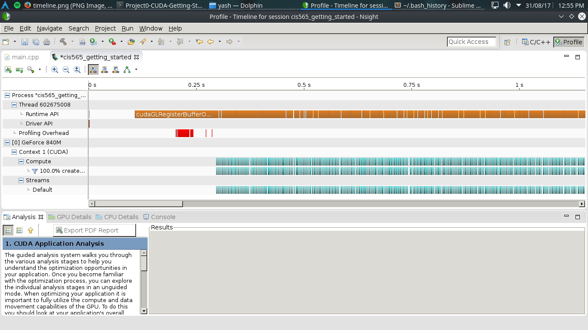

Project 0 CUDA Getting Started
====================

**University of Pennsylvania, CIS 565: GPU Programming and Architecture, Project 0**

* Ellen Duong
* Tested on: Windows 10, AMD Ryzen 7 1700 @ 3.00GHz 16GB, GTX 1080 (Personal)

### README

Main Output

Timeline Report of Performance Analysis for CUDA and OpenGL

Breakpoint Autos and Warps CUDA Info
