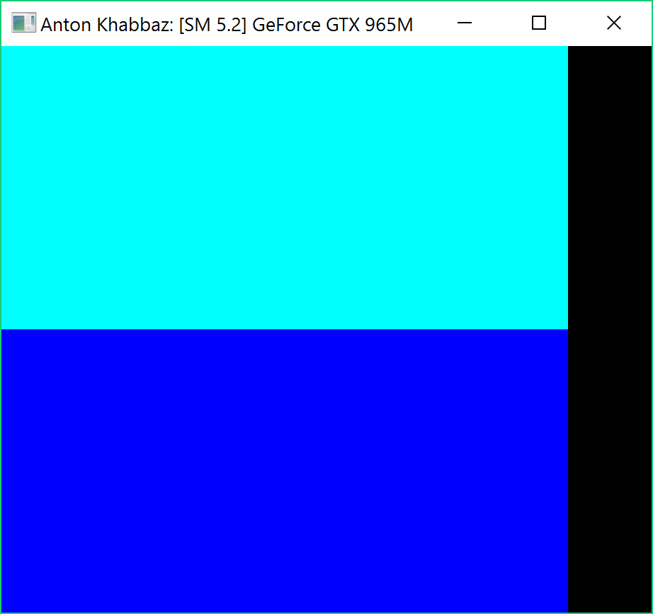
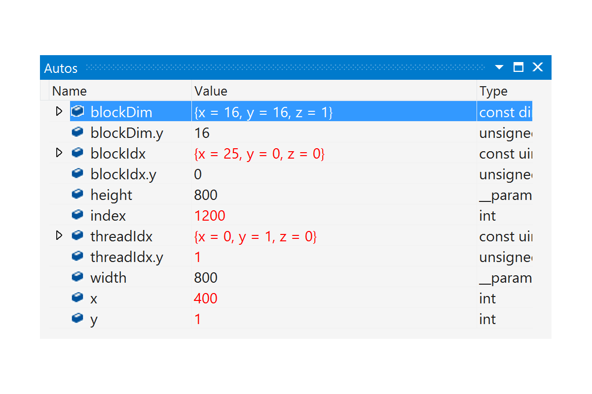
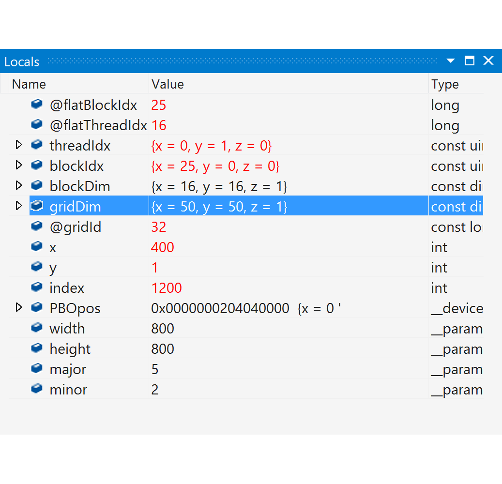
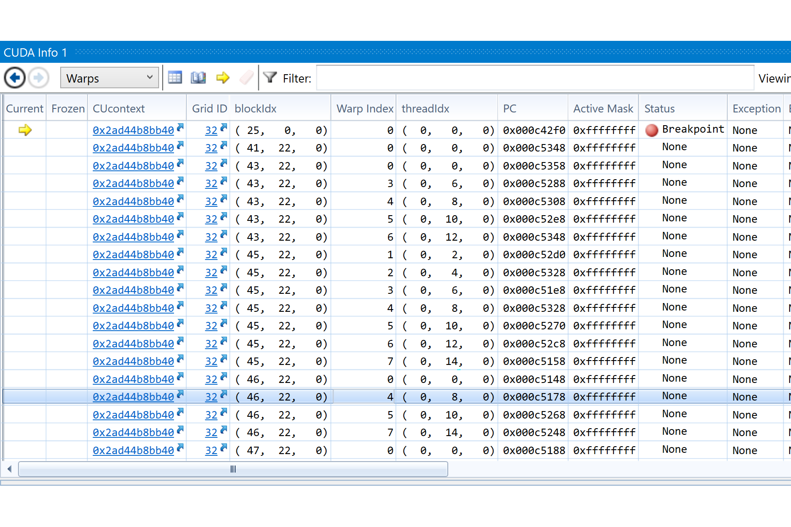

Project 0 CUDA Getting Started
====================

**University of Pennsylvania, CIS 565: GPU Programming and Architecture, Project 0**

* Anton Khabbaz
* pennkey:akhabbaz
* Tested on: Windows 10 surface book i7-6600u at 2.66 GHz with a GPU GTX 965M
Personal computer

### (TODO: Your README)

I finished all parts of this assignment, without needing to know much about CUDA.  I was able to install VS 2015, Cuda 8, Cmake
and Git Hub and I figured out how to fork. 

I had a real problem with Cmake.  The difficulty was that I had a previous installation of 
Visual Studio, 2017 that was enterprise.  I didn't try to install cuda 8 on that because I believe cuda 8 does not support
VS 2017 yet.  Anyway, I then had two versions 2015 and 2017.  When I ran Cmake, it would find the VS 2017 compiler and right away.
THe message was that the compiler worked on a simple program.  Later that build gave me issues and I thought that was unsolveable since cuda 8 does not support VS 2017 yet. I didn't try to get that to work too hard.

With VS 2015 it never found the compiler.  I told it where the compiler was I got a large kryptic message that I posted on the google group.  The suggestion offered by a TA didn't help either- I ran cmake from the command line and that didn't change the outcome.  I came to the sig lab and with Josh and another student, they also couldn't sort it out either.  I then uninstalled VS2017 and then it all went ahead as in the instructions.  I shouldn't have needed to uninstall a working VS installation, but I saw no other choice.
I think that when a later version of VS is installed, Cmake does not easily accept using the earlier version even though it claims otherwise.

I have a good command of Visual Studio so I figured out how to build the project easily. 
I took a screen shot of the colored images.  The build and run were straighforward.

. 

Nsight was installed on my computer and I was also able to run the samples of Cuda 8.  That told me that VS 2015 and Cuda 8 are installed and linked correctly.  

I got the debugger to break during cuda compiling.  I set the break point at line 30 and it stopped.  I added a conditional break at index = 1200 and it stopped at 1200 as expected.  Here is an image of that timeline.

I then looked at the autos and that confirmed that the index stopped at 1200.

I also got a screenshot of the block and thread that index= 1200 stopped at:

It all worked well on windows..Too bad I needed to uninstall VS 2017.
 didn't need to modify the CMakeLists.txt at all.  There were variables in the cmake gui that
 I thought I may need to define but that was not necessary.
