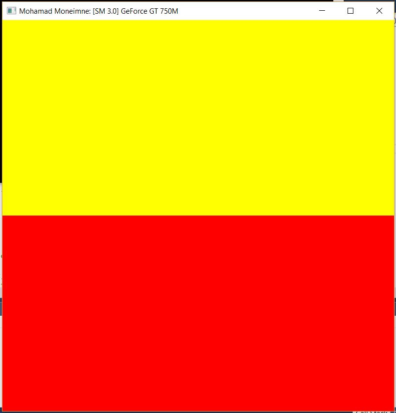
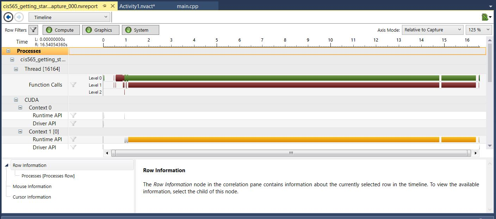
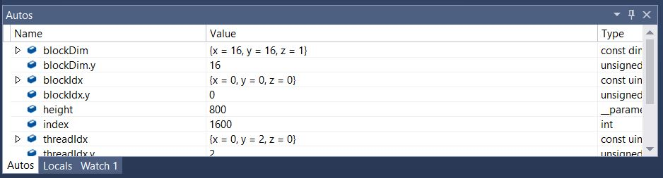
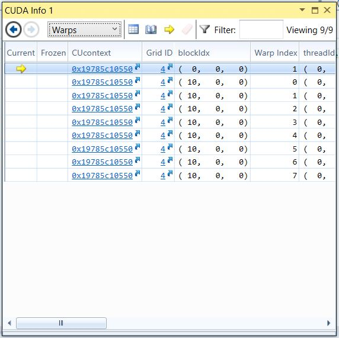

Project 0 CUDA Getting Started
====================

**University of Pennsylvania, CIS 565: GPU Programming and Architecture, Project 0**

* Mohamad Moneimne
* Tested on: Windows 10, i7-4700HQ @ 2.40GHz 8GB, GT 750M 2019MB (Personal Computer)

### Screenshots

**Version Visualization**

**Timeline**

**Autos**

**CUDA Debugging Warp Info**

