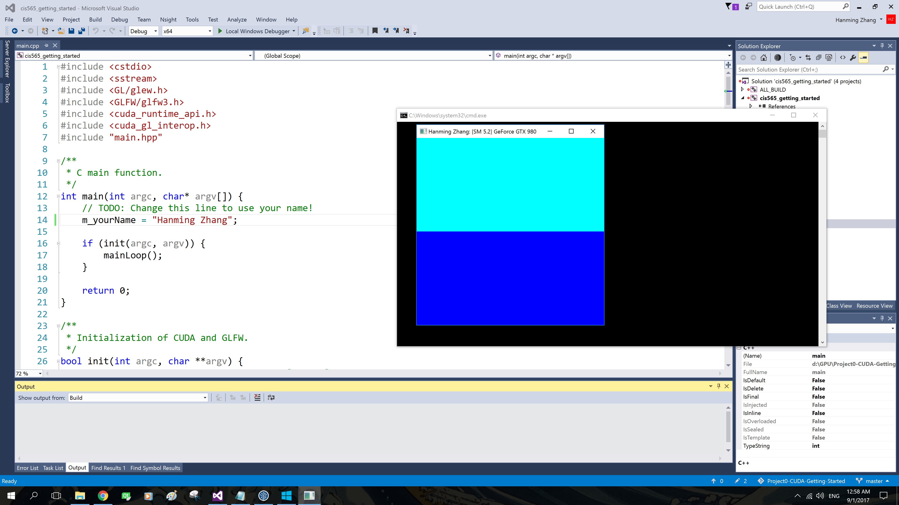
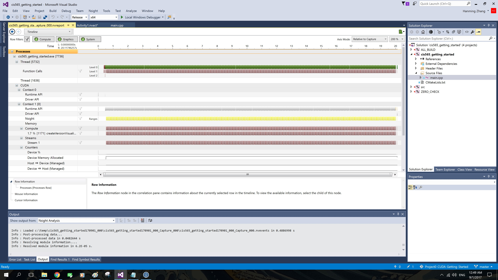
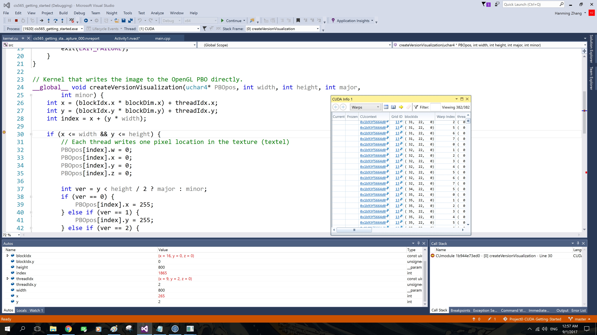

Project 0 CUDA Getting Started
====================

**University of Pennsylvania, CIS 565: GPU Programming and Architecture, Project 0**

* Name : Hanming Zhang
* Tested on: Windows 10, i7-6700K @ 4.00GHz 16.0GB, GTX 980 4096MB (Personal Desktop)

### 

Include screenshots, analysis, etc. (Remember, this is public, so don't put
anything here that you don't want to share with the world.)

-Part 4 Modify Screenshot

-Part 5 Analyze

-Part 5 Autos & CUDA Infos
