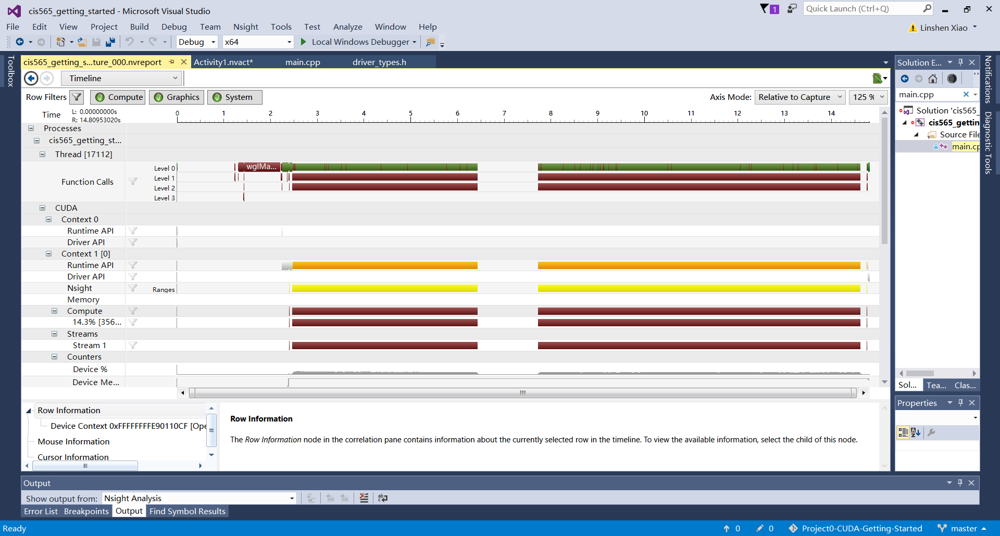
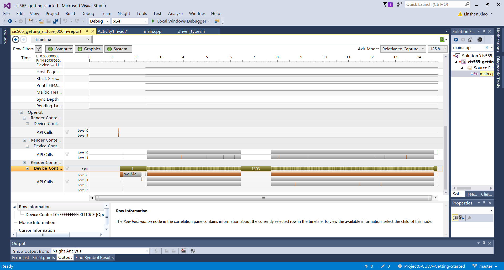
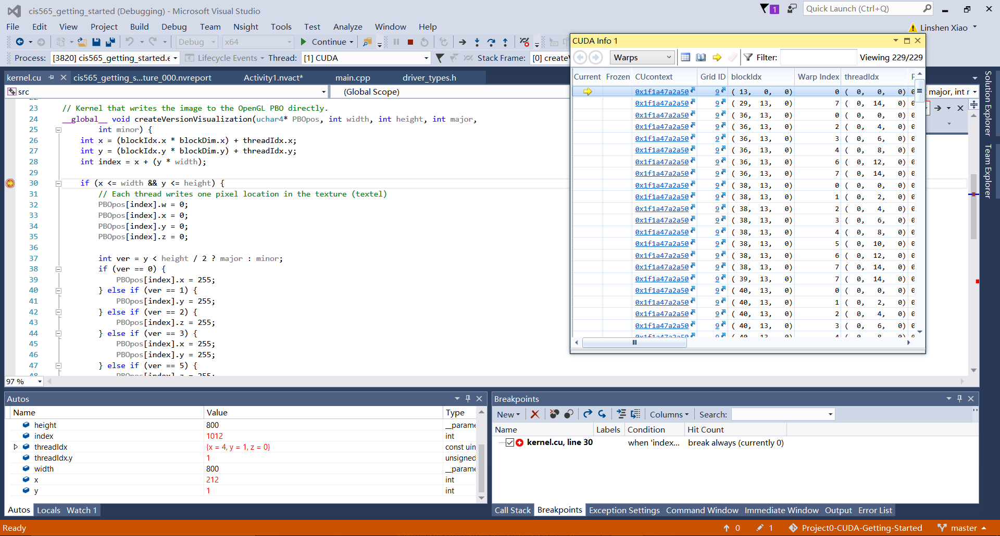

Project 0 CUDA Getting Started
====================

**University of Pennsylvania, CIS 565: GPU Programming and Architecture, Project 0**

* LINSHEN XIAO
* Tested on: Windows 10, Intel(R) Core(TM) i7-6700HQ CPU @ 2.60GHz, 16.0GB, NVIDIA GeForce GTX 970M (Personal computer)

A screenshot of the window (including title bar) with changed string to my name:

Two screenshots of the Timeline tab of performance analysis:

A screenshot of Autos window and CUDA info->warp:

