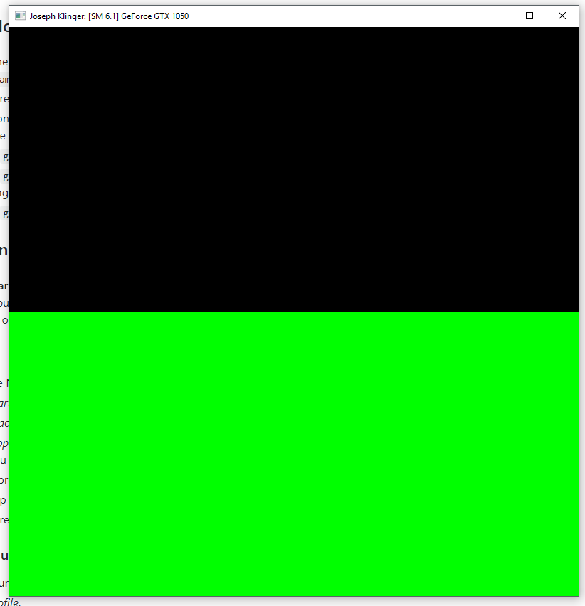
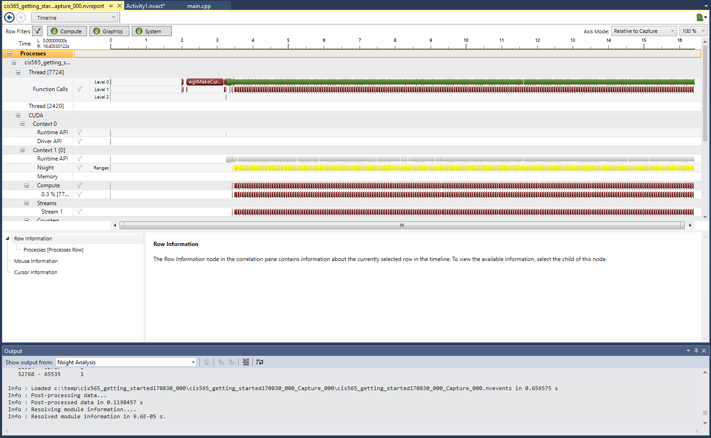

Project 0 CUDA Getting Started
====================

**University of Pennsylvania, CIS 565: GPU Programming and Architecture, Project 0**

* Joseph Klinger
* Tested on: (TODO) Windows 10, i5-7300HQ (4 CPUs) @ ~2.50GHz 2B, GTX 1050 6030MB (Personal Machine)

### README

After successfully installing and building, my personal machine resulted in the following image upon running:

Performance analysis yielded the following results:

After (finally) getting breakpoints and autos/locals to display properly, the following was the result of analyzing the Warps in CUDA Info 1:
