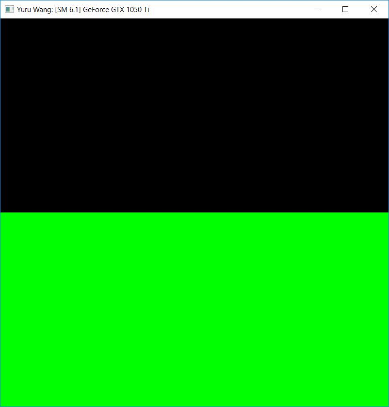
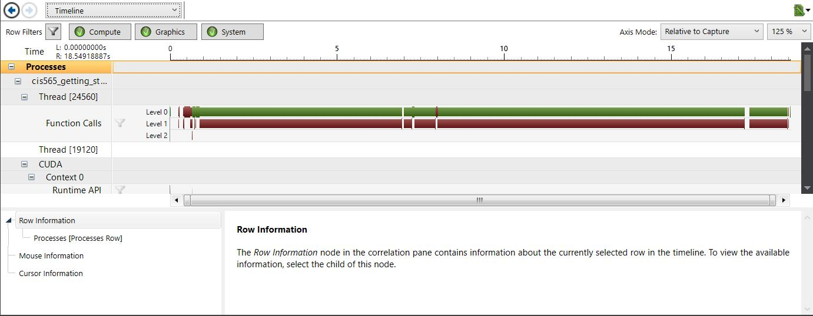
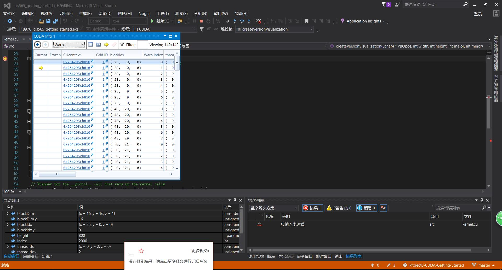

Project 0 CUDA Getting Started
====================

**University of Pennsylvania, CIS 565: GPU Programming and Architecture, Project 0**

* Yuru Wang
* Tested on: Windows 10, i7-7700HQ @ 2.5GHz 128GB, GTX 1050 Ti 8GB (personal computer)
* Modified CMakeList.txt: changed sm_20 to sm_60 inside cuda_add_library
* screenshots:

