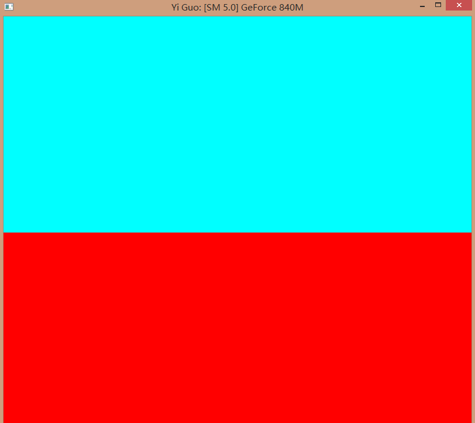
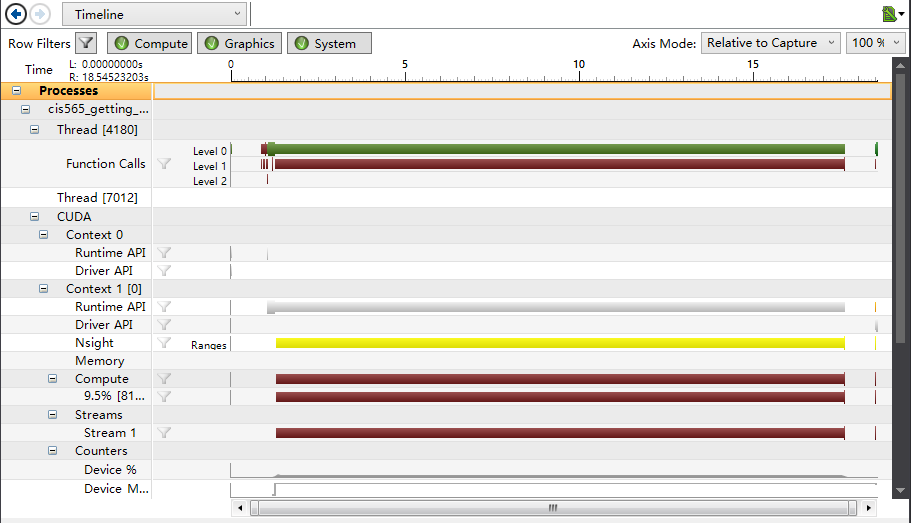
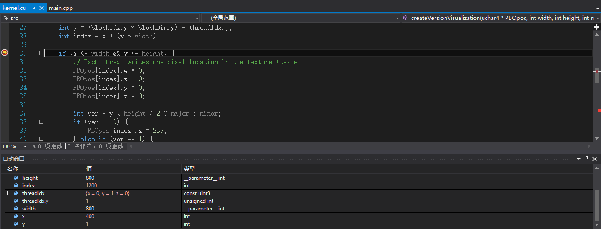
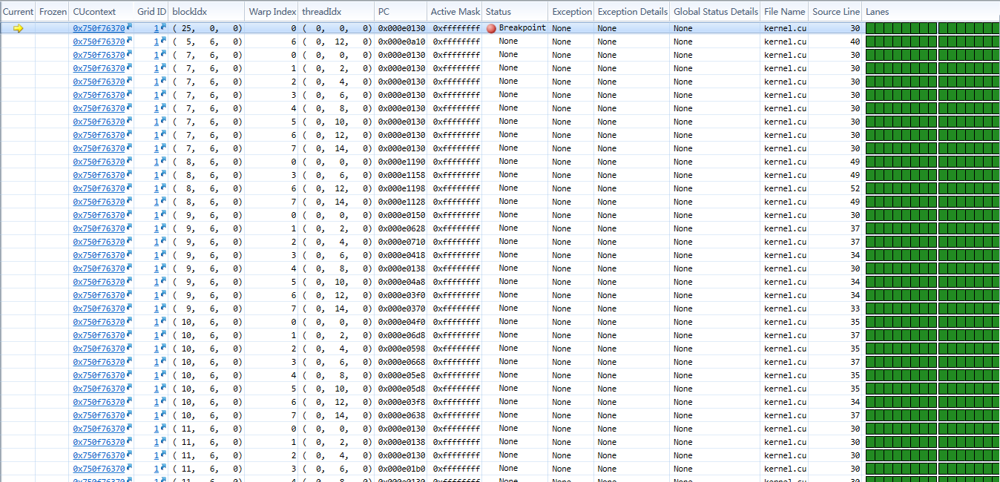

Project 0 CUDA Getting Started
====================

**University of Pennsylvania, CIS 565: GPU Programming and Architecture, Project 0**

* Yi Guo
* Tested on:  Windows 8.1, Intel(R) Core(TM)i5-4200M CPU @ 2.50GHz 8GB, NVIDIA GeForce 840M (Personal Notebook)

****Screenshot of the Test Window****
 
       
****Screenshot of the Performance Analysis****
 
       
****Screenshot of the Auto Window****
 

****Screenshot of the CUDA Info****
 

