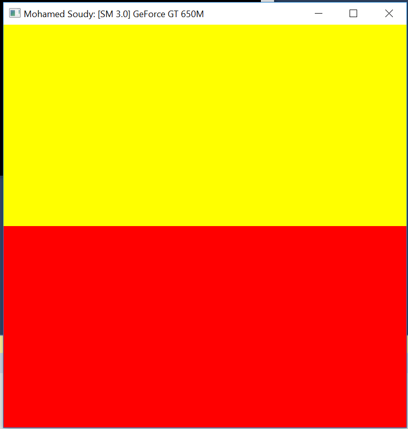
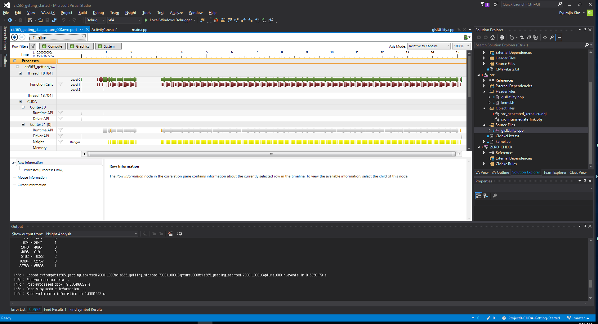

Project 0 CUDA Getting Started
====================

**University of Pennsylvania, CIS 565: GPU Programming and Architecture, Project 0**

* Mohamed Soudy
* Tested on: macOS 10.12.6, i7 @ 2.7 GHz 16GB, GT 650M 1024 MB

Screenshots
====================

CMakeList Edits
====================

Changed line 69 in CMakeLists.txt from find_package(CUDA 8.0 REQUIRED) to find_package(CUDA REQUIRED).

