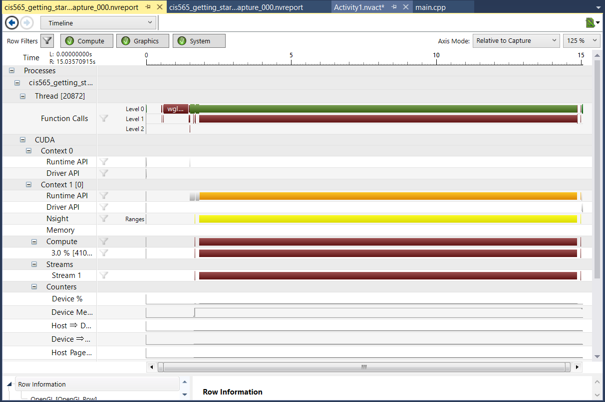
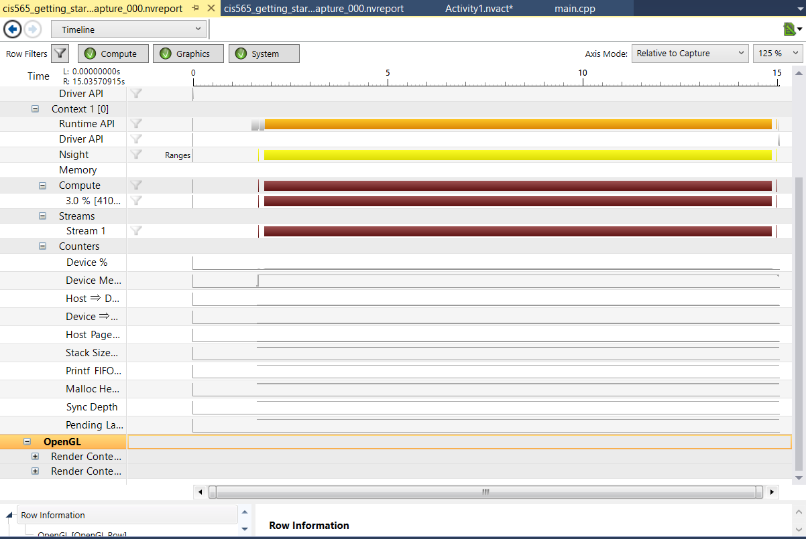
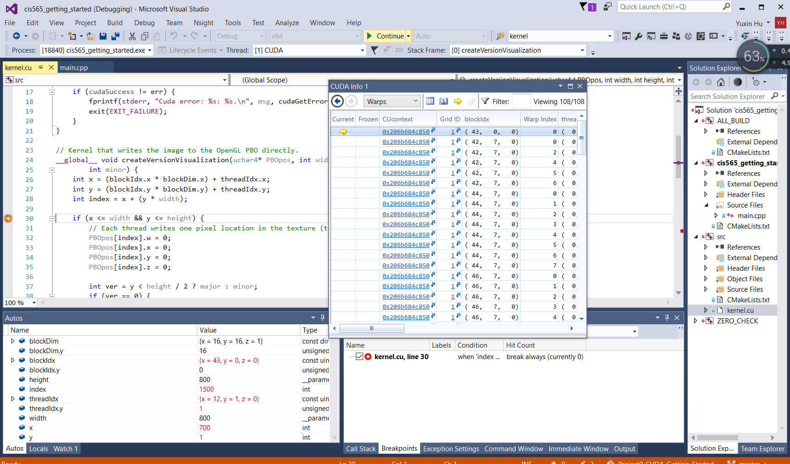

Project 0 CUDA Getting Started
====================

**University of Pennsylvania, CIS 565: GPU Programming and Architecture, Project 0**

* Yuxin Hu
* Tested on: Windows 10, i7-6700HQ CPU @ 2.60GHz 8GB, GTX 960M 1MB (Personal Laptop)

### Yuxin Hu
1. Programming Running Result

2. Performance Analaysis

3. Cuda Debug Info

