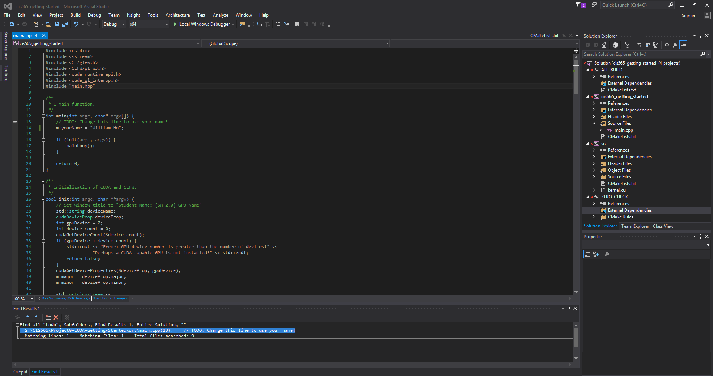
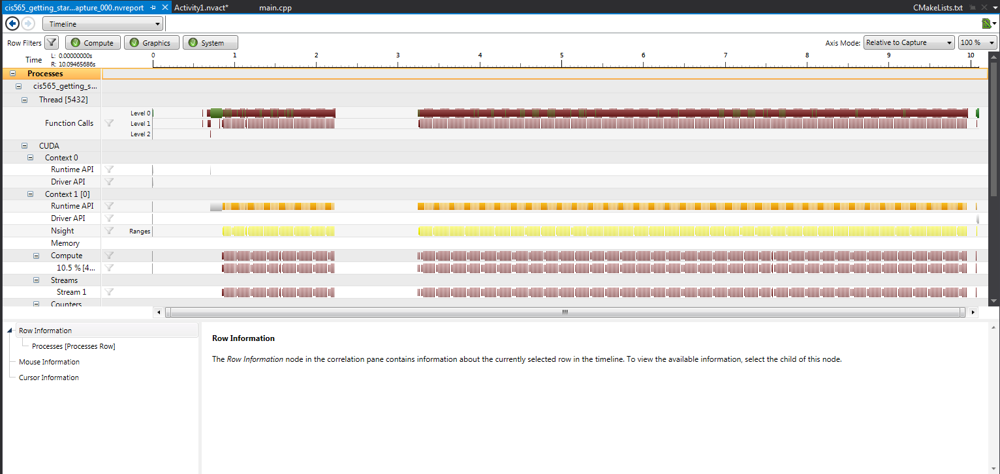
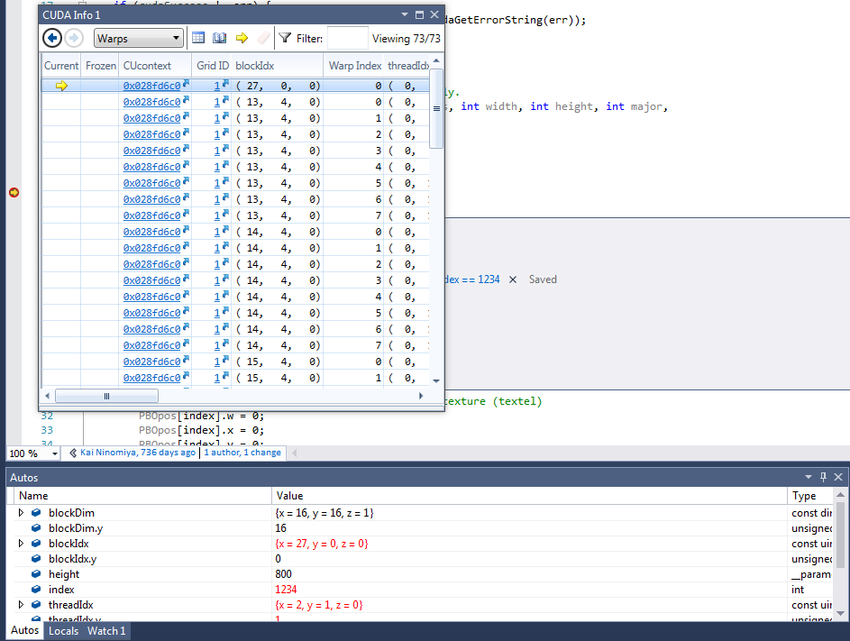

Project 0 CUDA Getting Started
====================

**University of Pennsylvania, CIS 565: GPU Programming and Architecture, Project 0**

* William Ho 
* Tested on: Windows 7 Professional, i7-6700 @ 3.40 GHz 16.0 GB, NVIDIA Quadro K620 (Moore 100C Lab)

Include screenshots, analysis, etc. (Remember, this is public, so don't put
anything here that you don't want to share with the world.)

