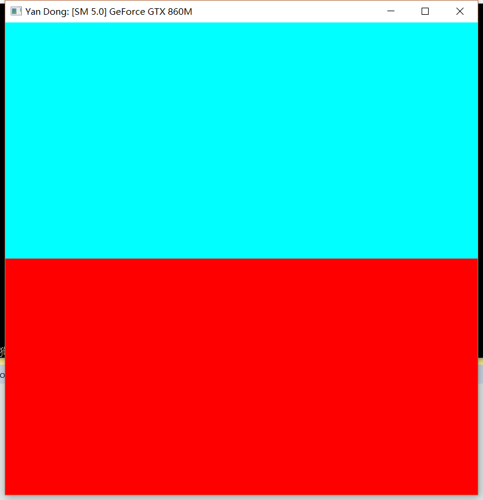
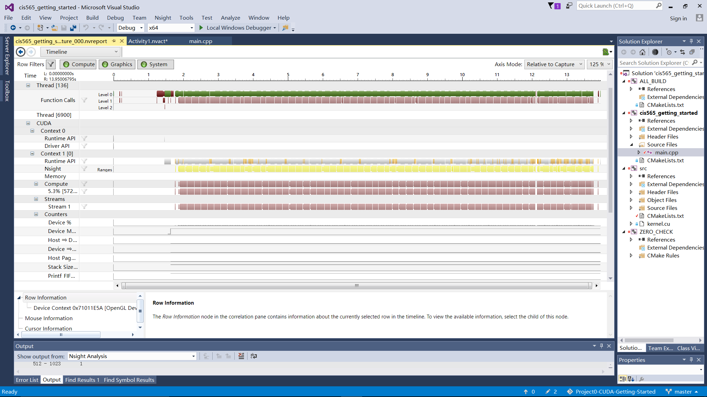
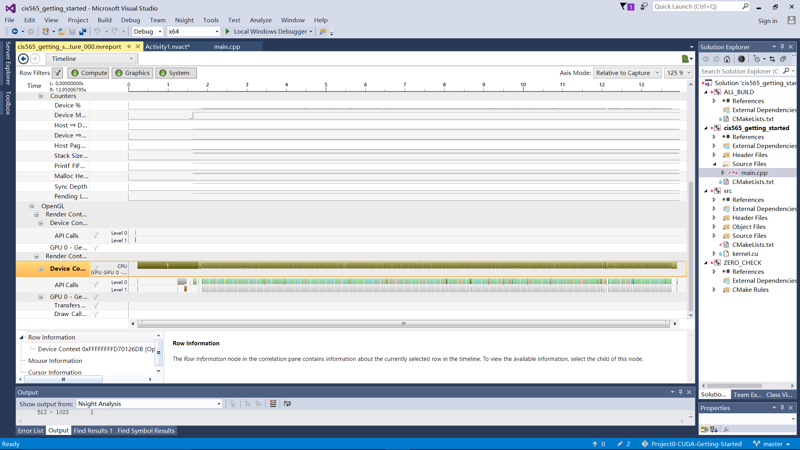
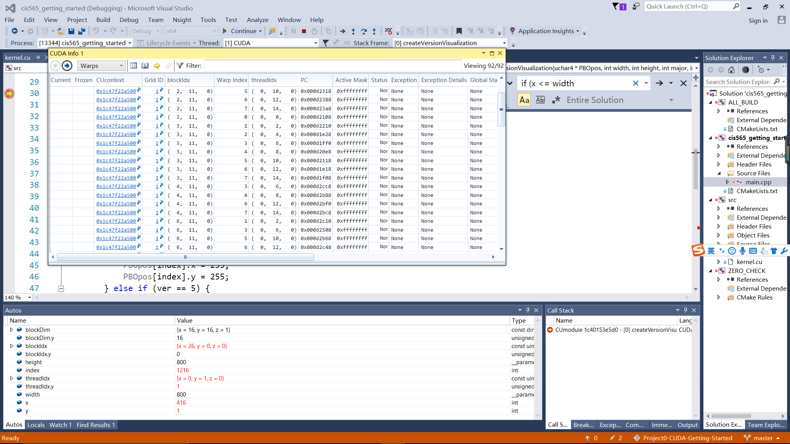
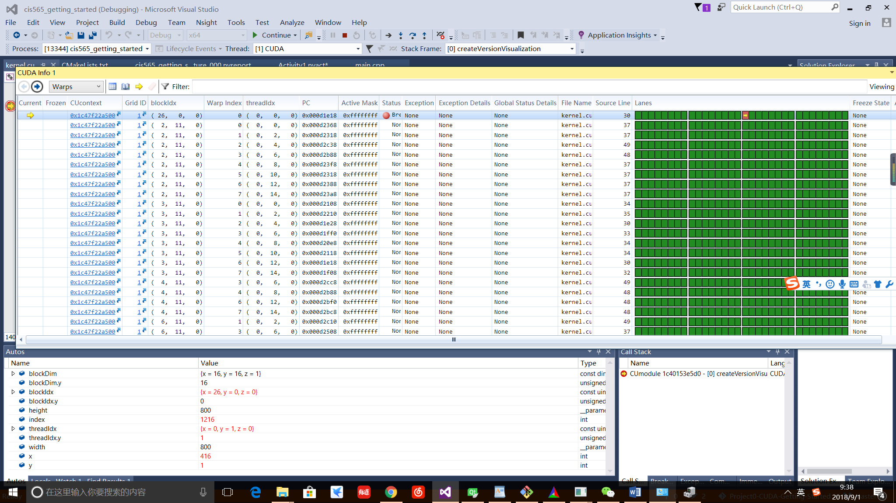

# Project0-CUDA-Getting-Started
cis 565 hw0

•	Yan Dong 
* [LinkedIn](https://www.linkedin.com/in/%E8%A8%80-%E8%91%A3-572b1113b/) 

•	Tested on: Windows 10, i7-4170HQ @ 2.50GHz 8GB, GTX 860 1GB  
•	Change: `CMakeLists.txt`-> OPTIONS -arch=sm_50 

### Run Result

### Nsight Debugger Result

