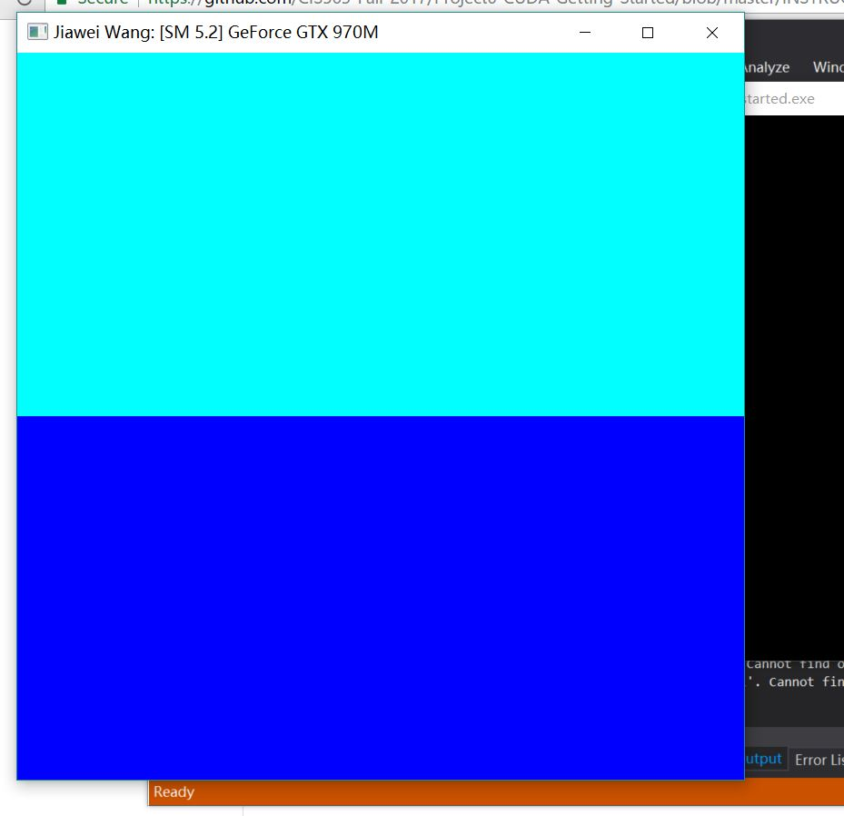
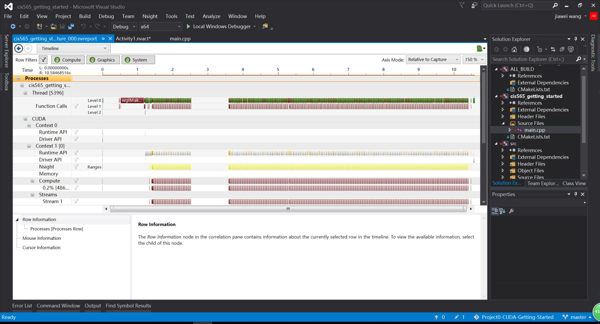

Project 0 CUDA Getting Started
====================

**University of Pennsylvania, CIS 565: GPU Programming and Architecture, Project 0**

* Jiawei Wang
* Tested on: Windows 10, i7-6700 @ 2.60GHz 16.0GB, GTX 970M 3072MB (Personal)

### Project 0 Results:

*Part 4 Modify:*
  
*Part 5 Analyze:*
  
*Part 6 Nsight Debugging:*
  
  

