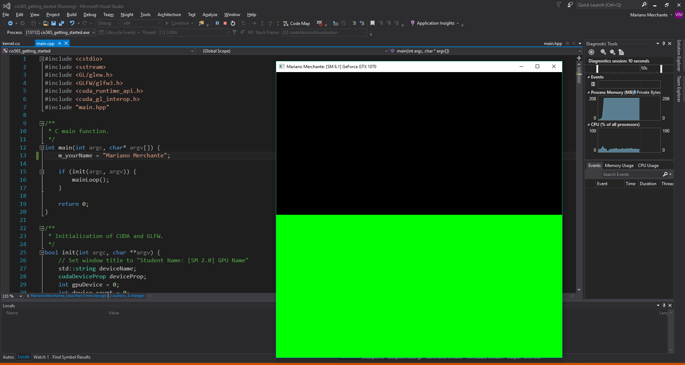
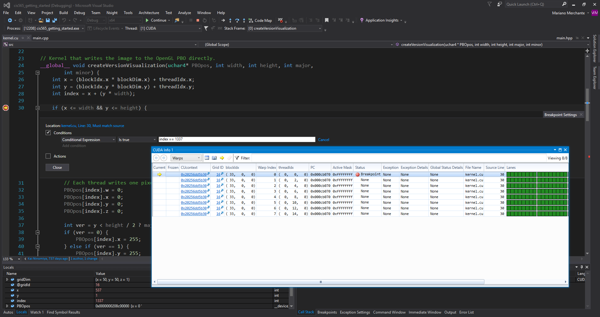

Project 0 CUDA Getting Started
====================

**University of Pennsylvania, CIS 565: GPU Programming and Architecture, Project 0**

* Mariano Merchante
* Tested on
  * Microsoft Windows 10 Pro
  * Intel(R) Core(TM) i7-6700HQ CPU @ 2.60GHz, 2601 Mhz, 4 Core(s), 8 Logical Processor(s)
  * 32.0 GB RAM
  * NVIDIA GeForce GTX 1070 (mobile version)

## Details

A simple project setup excercise for CUDA development. Had a lot of issues with CMake and VS, because I had a broken installation of VS 2017 RC before.

The project running

Timeline

The debugger running with a conditional breakpoint of index == 1337

