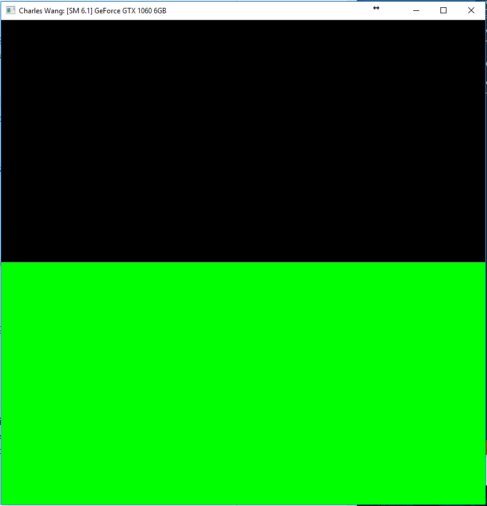
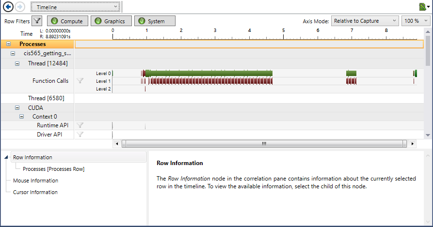
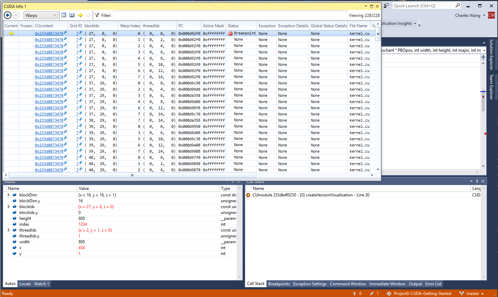

Project 0 CUDA Getting Started
====================

**University of Pennsylvania, CIS 565: GPU Programming and Architecture, Project 0**

* Charles Wang
* Tested on: Windows 10, i7-6700K @ 4.00GHz 22GB, GTX 1060 6GB (Personal Computer)

### (TODO: Your README)

PART 4: Modify

Visual Studio solution was built properly. With my name included in the code, the program runs like this:

PART 5:

Running the performance analysis looks like this:

Part 6:

The CUDA Info 1 window and autos/locals look like this:

