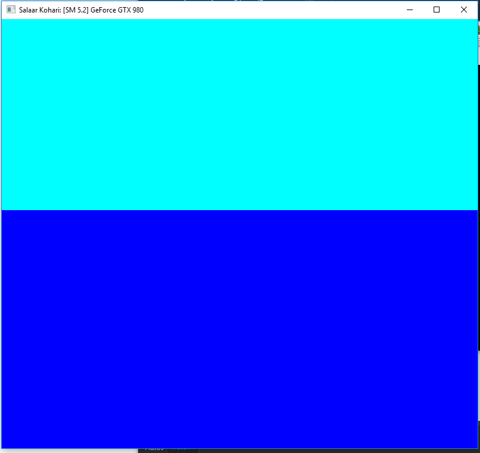
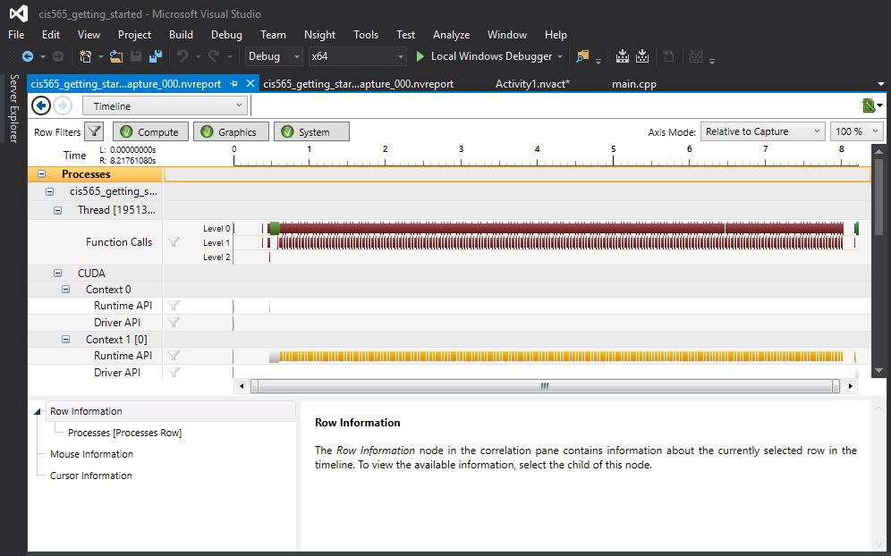

Project 0 CUDA Getting Started
====================

**University of Pennsylvania, CIS 565: GPU Programming and Architecture, Project 0**

* Salaar Kohari
  * [LinkedIn](https://www.linkedin.com/in/salaarkohari), [personal website](http://salaar.kohari.com)
* Tested on: Windows 10, Intel Xeon @ 3.1GHz 32GB, GTX 980 4GB (SIG Lab)

### Screenshots/Analysis

Implemented analysis as described in instructions. The debug breakpoint could not be hit due to a gpu debugging setting that I could not access. Tried reinstalling everything to no avail.

