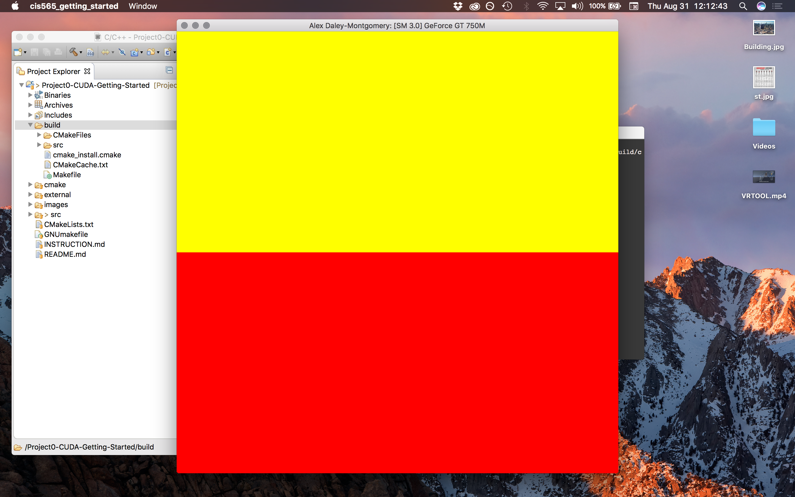
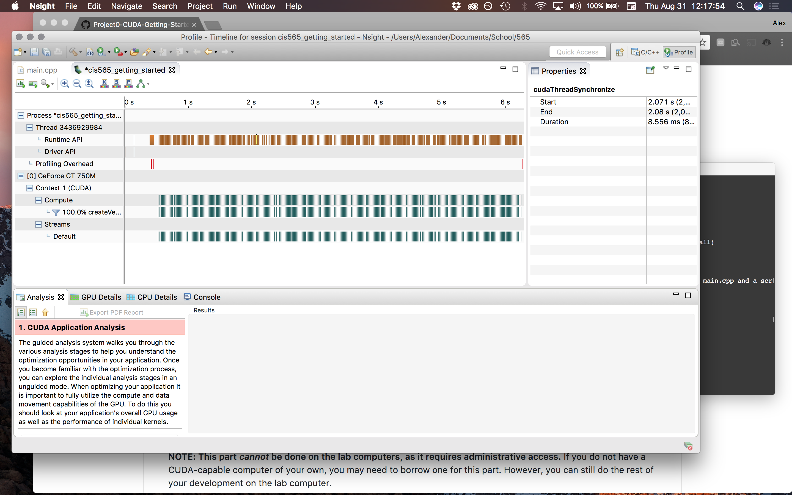

Project 0 CUDA Getting Started
====================

**University of Pennsylvania, CIS 565: GPU Programming and Architecture, Project 0**

*  Daniel Daley-Montgomery
* Tested on: MacBook Pro, OSX 10.12, i7 @ 2.3GHz, 16GB RAM, GT 750M 2048MB (Personal Machine)

**Results**

* In order to build the project, I seemed to have to downgrade my Apple clang version from Command Line Tools 8.3 to lower (I chose 7.3).

* When running the project, the following image is displayed:

* Having run the profiler for a few seconds, this how the tasks were distributed:

