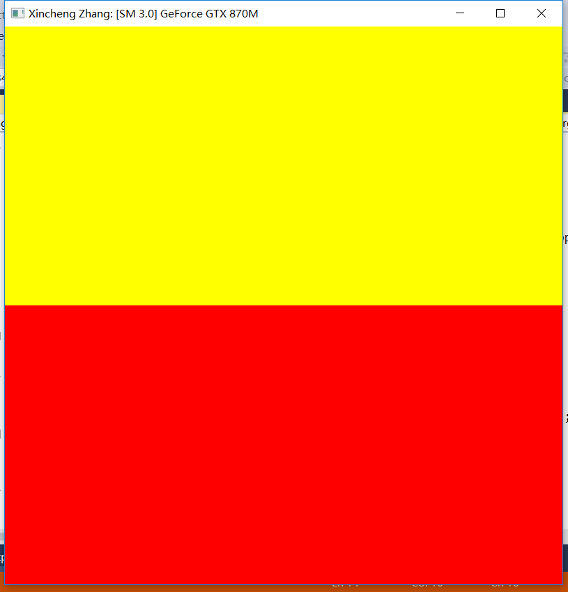
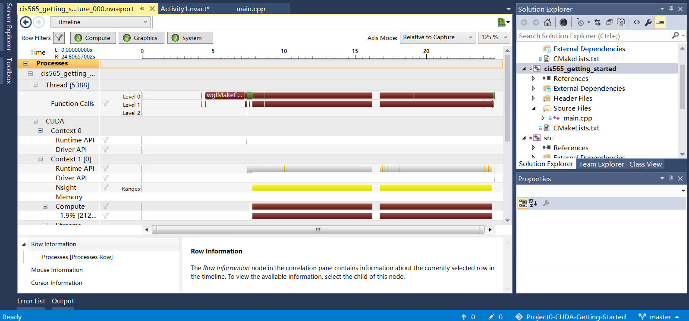
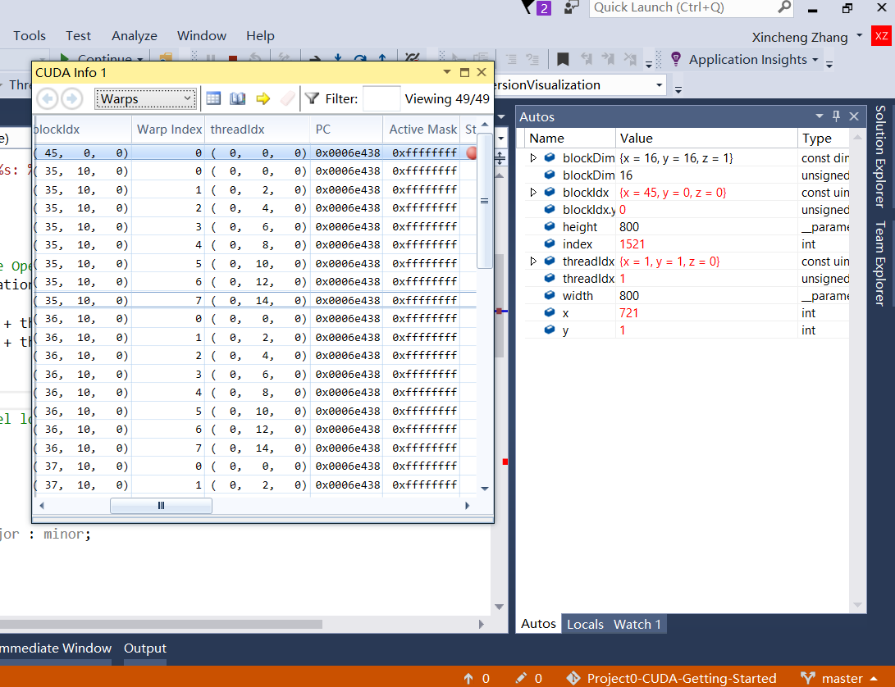

Project 0 CUDA Getting Started
====================

**University of Pennsylvania, CIS 565: GPU Programming and Architecture, Project 0**

* (TODO) Xincheng Zhang
* Tested on: (TODO) Windows 10, i7-4702HQ @ 2.20GHz 8GB, GTX 870M 3072MB (Personal Laptop)

### (TODO: Your README)

Include screenshots, analysis, etc. (Remember, this is public, so don't put
anything here that you don't want to share with the world.)

