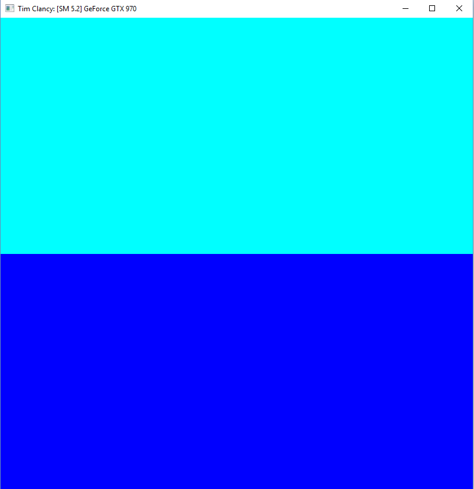
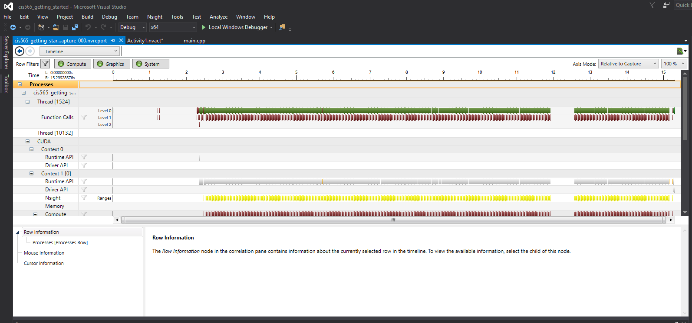
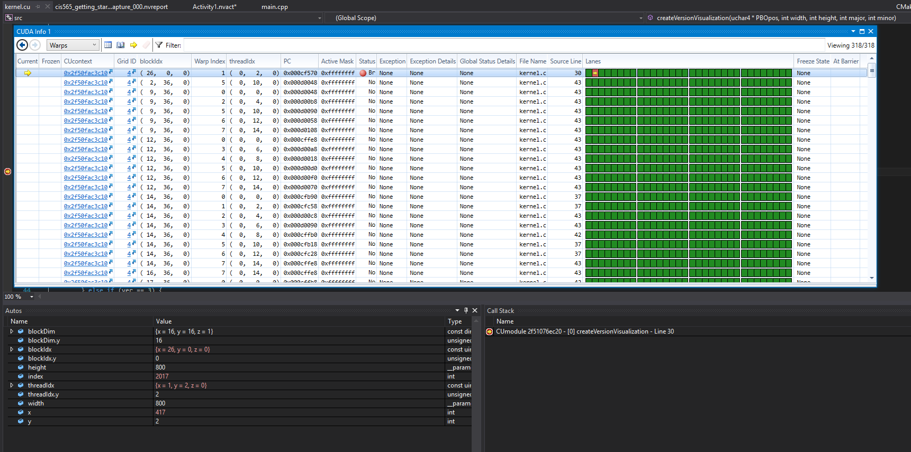

Project 0 CUDA Getting Started
====================

**University of Pennsylvania, CIS 565: GPU Programming and Architecture, Project 0**

* Tim Clancy (clancyt)
* Tested on: (Personal) Windows 10, i5-4590 @ 3.30GHz 8GB, GTX 970

### Analysis

Here are the three screenshots from testing.

The modified project window stating name:

The Nsight Timeline after running the application for a bit:

The Nsight Warps and Autos after running the debugger, with an index breakpoint set to 2017:

