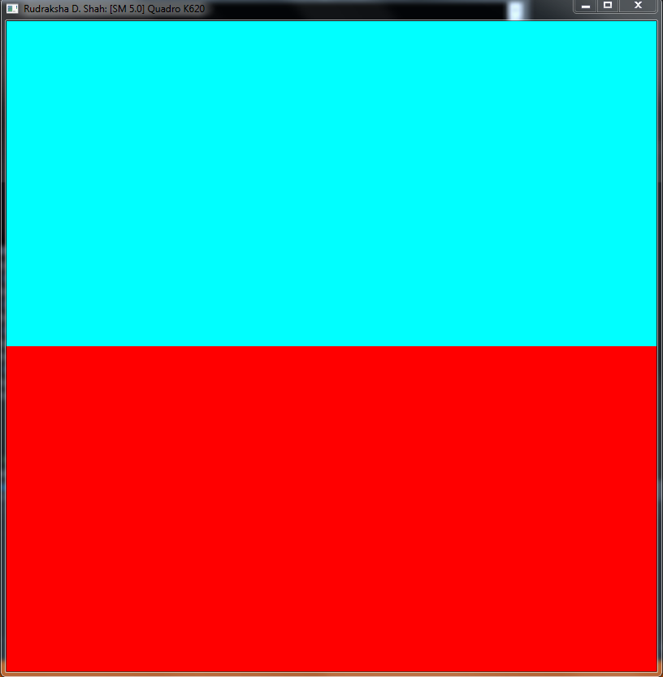

Project 0 CUDA Getting Started
====================

**University of Pennsylvania, CIS 565: GPU Programming and Architecture, Project 0**

* Rudraksha D. Shah
* Tested on: Windows 7, i7-6700 @ 3.40GHz 16GB, Quadro K620 2048MB (Moore 100c Lab)

### Cuda 101

- Verifying the Gpu and Version

	

- Nsight Analysis Output

	
	
- Nsight Debugging Test Output

	

