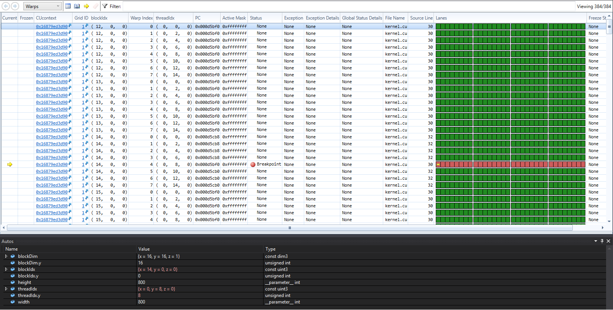

Project 0 CUDA Getting Started
====================

**University of Pennsylvania, CIS 565: GPU Programming and Architecture, Project 0**

* Sarah Forcier
* Tested on: Windows 10, Xeon(R) CPU E5-130 @ 3.70GHz, Geforce GTX 1070 (SIG Lab)

### Build & Run: Output Window

### Analyze: Timeline 

### Nsight Debugging: Breakpoint

