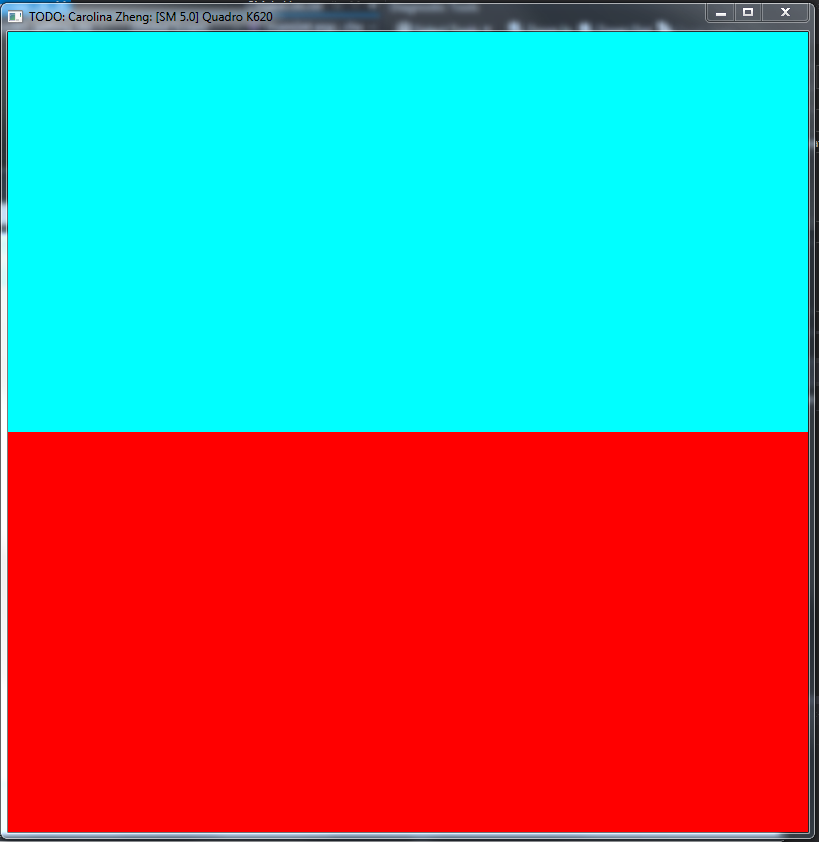

Project 0 CUDA Getting Started
====================

**University of Pennsylvania, CIS 565: GPU Programming and Architecture, Project 0**

* Carolina Zheng
* Tested on: Windows 7, i7-6700 @ 3.40GHz 16GB, Quadro K620 (Moore 100C-07 Lab)

### Screenshots

