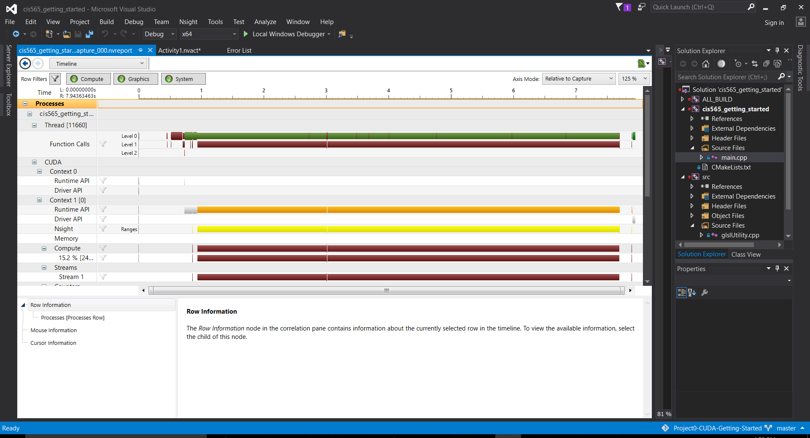

Project 0 CUDA Getting Started
====================

**University of Pennsylvania, CIS 565: GPU Programming and Architecture, Project 0**

* Daniel McCann
* Tested on: Windows 10, i7-5700HQ CPU @ 2.70GHz, GeForce GTX 970M, 16 GB RAM

### README

Output from running the demo:

Output from the timeline:

Breakpoint in CUDA kernel:

CUDA info:

