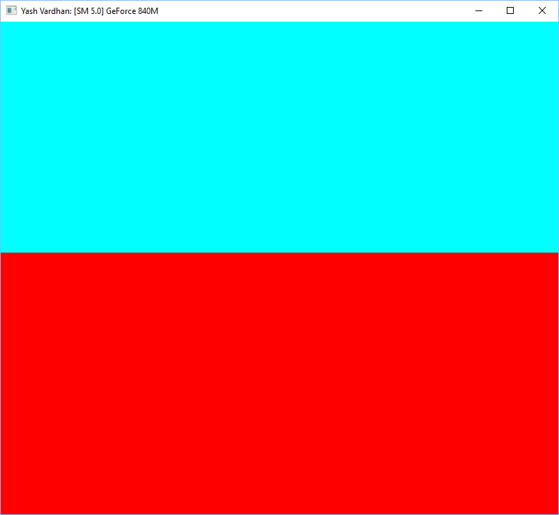

Project 0 CUDA Getting Started
====================

**University of Pennsylvania, CIS 565: GPU Programming and Architecture, Project 0**

* Yash Vardhan
* Tested on: Windows 10 Pro, Intel i5-4200U (4) @ 2.600GHz 4GB, NVIDIA GeForce 840M 2048MB
* Previously tested on Kubuntu 16.04.3, same configuration.

Details
=========
I had to migrate my environment from Kubuntu to Windows to get started on debugging.

### Results

Part 4:

Part 5:

Part 6:

