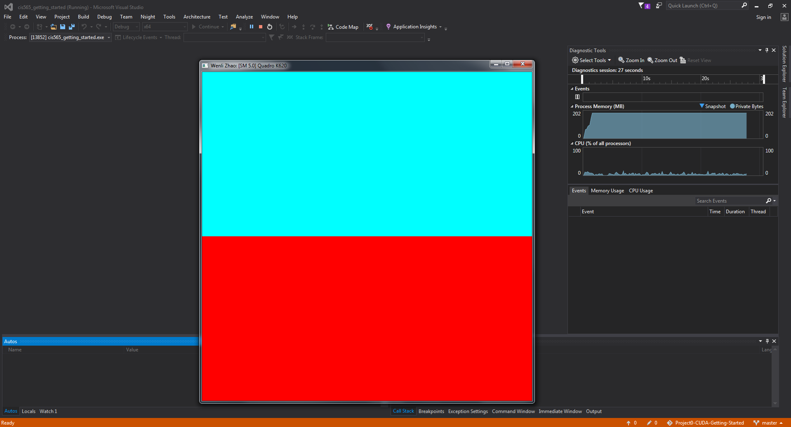
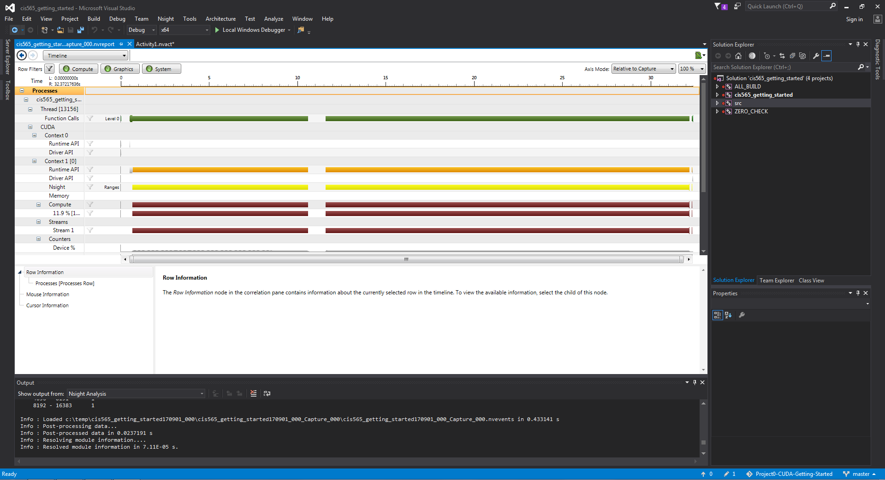
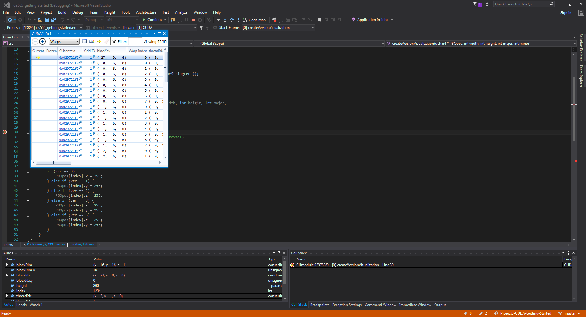

Project 0 CUDA Getting Started
====================

**University of Pennsylvania, CIS 565: GPU Programming and Architecture, Project 0**

* WENLI ZHAO
* Tested on: Windows 7, i7-6700 CPU @ 3.40GHz, NVIDIA Quadro K620 (Moore 100C Lab)

### ReadMe

# Screenshot 1

# Screenshot 2

# Screenshot 3

Include screenshots, analysis, etc. (Remember, this is public, so don't put
anything here that you don't want to share with the world.)

