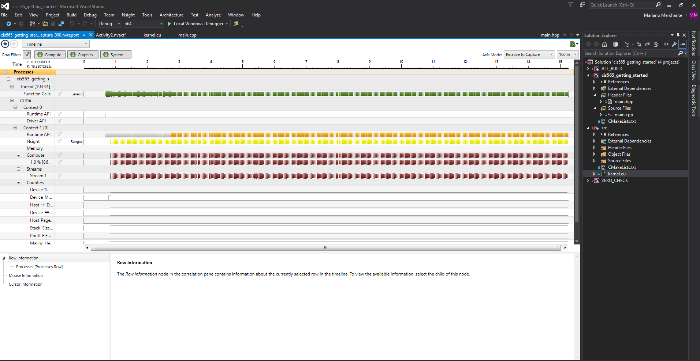

Project 0 CUDA Getting Started
====================

**University of Pennsylvania, CIS 565: GPU Programming and Architecture, Project 0**

* Mauricio Mutai
* Tested on: Windows 10, i7-7700HQ @ 2.80GHz 16GB, GTX 1050Ti 4GB (Personal Computer)

** Part 4: ** Image showing title bar modified to have my name

** Part 5: ** Image of __Timeline__ in the Nsight Performance Analysis

** Part 6: ** Image of __Autos__ and __CUDA Info -> Warp__ from CUDA Debugging

