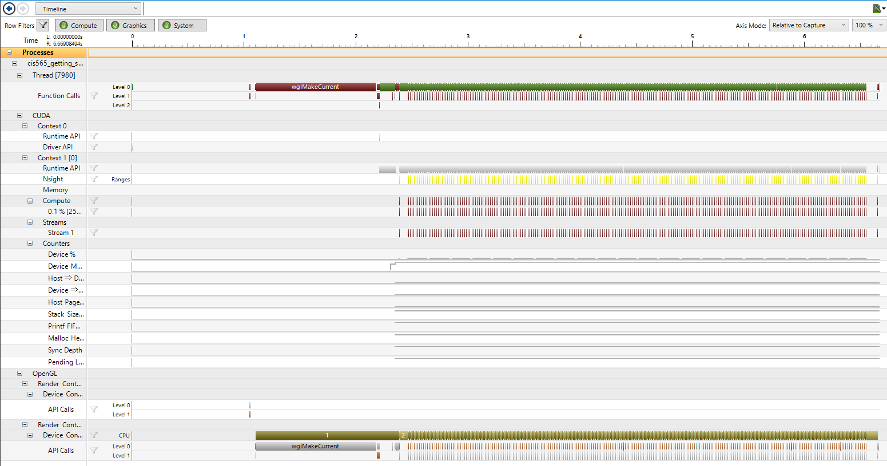

Project 0 CUDA Getting Started
====================

**University of Pennsylvania, CIS 565: GPU Programming and Architecture, Project 0**

* Byumjin Kim
* Tested on: Windows 10, i7-6700HQ @ 2.60GHz 15.89GB, GTX 1060 (Personal)

###

- Screenshot of the project

- Screenshot of Timeline

- Screenshot of Autos

- Screenshot of CUDA Info1
